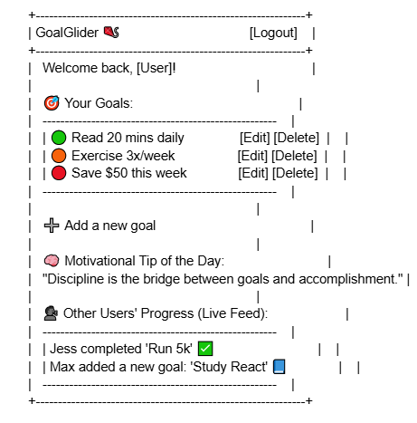

# StartupGoalGlider

## Overview

StartupGoalGlider is a web-based application I built that combines two big parts: a version of the Simon memory game and a personal goal-tracking app called GoalGlider. The whole point of this was to show that I could build something from start to finish using real technologies, and actually make it look good and work well.

It wasn’t all smooth — I had times where I was stuck for hours on things I thought should take five minutes. But I learned how to break things down, test, and fix them one by one. That process took a while, but it made everything way more solid.

---

## Features
## Visual Layout Previews

### Dashboard Layout

### Login and Register Layout

### GoalGlider
- Users can log in, add goals, and track progress
- Edit and delete goals from your list
- Daily motivational quote from ZenQuotes API
- Simulated live activity feed to make it feel more social

### Simon Game
- Memory-based game with four color buttons
- Sequence gets harder each level
- Visuals update as you go
- Scoreboard that saves high scores per user using localStorage
- Smooth transitions and better game-over feedback

---

## Technologies Used

- **HTML** — Built all the pages with semantic structure
- **CSS** — Used Flexbox and Grid for layout; custom styles to polish the UI
- **JavaScript** — Handles all the interaction, animations, logic, storage, and API calls
- **ZenQuotes API** — For getting quotes dynamically on login
- **localStorage** — Stores users, goals, and scores without needing a database

---

## Figuring it out 

### "The colors don’t really pop — can we make them more intense?"
Yes — I changed the button animations to include `filter: brightness(3)`, `scale(1.2)`, and a glowing `box-shadow`. I had to modify both the CSS and the `game.js` file to trigger the `.pressed` class at the right time.

### "How do I get the quote to show every time?"
I used the ZenQuotes API and wrote a `fetchQuote()` function inside `goalglider.html`. It calls the API and updates the DOM with the response.

### "Why isn't my Simon game starting?"
Turns out jQuery wasn’t loading. Once I added the CDN link and wrapped my functions in jQuery’s `$(document).on("click")`, the game finally worked.

### "How do I display a scoreboard that saves the player name?"
I stored scores in `localStorage` with the name as the key and an array of scores as the value. Then I sorted them in `scores.html` and showed them in a list.

### Color Feedback

One of the biggest things that bugged me during playtesting was the button flash. It just didn’t feel satisfying when a color lit up. I said something like, “I feel like the colors aren’t really popping,” and that’s when I decided to rewrite the animation.

I added a `pressed` class and used a `@keyframes flash` animation in CSS. I turned up the brightness filter and added a white glow. The final version actually makes it really obvious when it’s the game’s turn or the user clicks.

I also changed the JavaScript so that the color animations use this new visual instead of a boring fadeOut/fadeIn.

---

### Layout & Style

At first, the pages looked really basic — like something from 2005. So I started tweaking the CSS:
- Added shadows and border-radius to containers
- Made everything centered and clean
- Switched to a nicer font
- Made sure it works on wider screens

I wanted it to feel more like a modern website, not just a school project.

---

### Goal Editing

Originally, you could only add goals, but there was no way to fix mistakes or remove anything. That felt like a big gap. So I updated the goal list code and added **Edit** and **Delete** buttons next to each goal.

That was harder than I thought because I had to figure out how to rebuild the list dynamically and still keep the buttons working. But once I got it, it made the dashboard feel way more complete.

---

### Making It Feel Real

The motivational quote and live feed aren’t just there to look pretty — they help make the GoalGlider part feel like something you’d actually want to use daily. The quote changes every time you log in (as long as the API loads), and the feed pretends to show updates from other users.

I simulated that for now, but if I were to build a real backend with WebSockets, that’s where it would go.

---

## Pages Breakdown

### `home.html`
Landing page with login input. Stores your name for use in other parts of the app.

### `play.html`
Main Simon game interface. Reacts to clicks and sequences, updates your score.

### `scores.html`
High score list sorted by top scores across all players.

### `about.html`
Quick summary of what the Simon game is and what this project does.

### `goalglider.html`
The goal tracker dashboard. Login, goal list, quote, and feed — all in one place.

---

## Future Ideas

- Add mobile support and responsive layouts
- Create a dark mode theme
- Add real authentication and database support
- Use WebSocket to make the feed actually live
- Play a sound or animation when a goal is completed

---

## Final Thoughts

I really liked seeing this come together. It didn’t happen all at once. I had to test, fix, and redo things multiple times. But that made me more confident with HTML/CSS/JavaScript. It also helped me realize how important the small details are — things like how a button flashes, or how a list reloads, really change how polished it feels.

Overall, this was a big learning experience and something I feel good about showing off.

---

## More Things I Had to Figure Out

### "Why doesn't localStorage work for every player?"
At first, I thought localStorage would magically just remember everything per user — turns out, it's tied to the browser and doesn't support multiple users out of the box. I ended up storing scores as an object with player names as keys and arrays of scores as values. That way, each user could have their own scores tracked.

### "Why did my CSS styles just stop applying?"
This one drove me nuts. I had copied the CSS file from an earlier version and forgot I renamed it later. The `link` tag in the HTML still pointed to `main.css` instead of `style.css`. One small letter was breaking the whole thing.

### "How do I show the top scores in the right order?"
When I first loaded the scores, they were all over the place. I used `.map()` to convert the object into an array of player-score pairs and then `.sort()` to put the highest scores first. That also helped me practice working with nested arrays.

### "Why won’t the images load in GitHub?"
Capitalization. I had `Capture1.PNG` and was trying to embed `capture1.png`. GitHub is case-sensitive, and fixing the file path was all it took. I also had to make sure the images were in the right folder and the README used relative paths.

### "Why do the buttons light up but there's no sound?"
I had forgotten to actually place the `.mp3` files in the project. The code was trying to play sounds that didn’t exist. Once I added the audio files and tested them individually, it worked perfectly.

### "How do I keep the Simon game from triggering too fast?"
I had the game call the next round immediately after a correct click, but it wasn’t giving enough time between flashes. I added a `setTimeout` to delay the next sequence and give players a chance to breathe.

---
